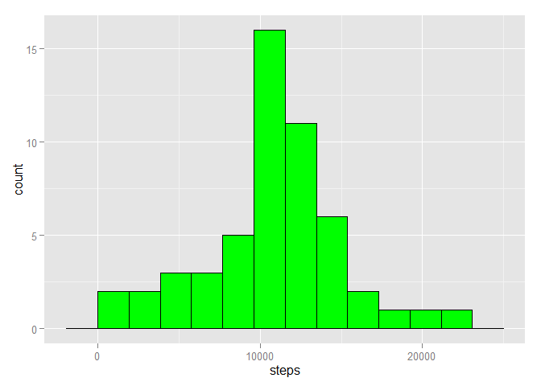
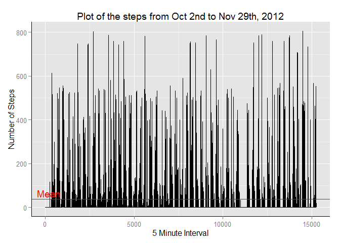
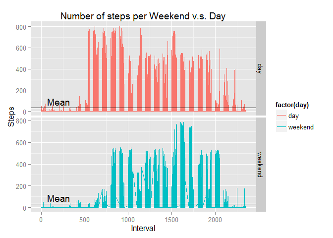

# Reproducible Research: Peer Assessment 1


## Loading and preprocessing the data
* start with selecting some libraries
* and then loading the data
* Lets provide a brief examination of the data

```r
library(lubridate)
library(plyr)
```

```
## 
## Attaching package: 'plyr'
## 
## The following object is masked from 'package:lubridate':
## 
##     here
```

```r
library(ggplot2)

data<-read.csv (file="./activity.csv")
str (data)
```

```
## 'data.frame':	17568 obs. of  3 variables:
##  $ steps   : int  NA NA NA NA NA NA NA NA NA NA ...
##  $ date    : Factor w/ 61 levels "2012-10-01","2012-10-02",..: 1 1 1 1 1 1 1 1 1 1 ...
##  $ interval: int  0 5 10 15 20 25 30 35 40 45 ...
```

```r
summary (data)
```

```
##      steps                date          interval     
##  Min.   :  0.00   2012-10-01:  288   Min.   :   0.0  
##  1st Qu.:  0.00   2012-10-02:  288   1st Qu.: 588.8  
##  Median :  0.00   2012-10-03:  288   Median :1177.5  
##  Mean   : 37.38   2012-10-04:  288   Mean   :1177.5  
##  3rd Qu.: 12.00   2012-10-05:  288   3rd Qu.:1766.2  
##  Max.   :806.00   2012-10-06:  288   Max.   :2355.0  
##  NA's   :2304     (Other)   :15840
```


## What is mean total number of steps taken per day?
### Process [via creating a new data.frame]
* Sum the number of steps per day
* Add a column of the "day of the week"
* Compute the mean of the total number of step per day
* Compute the median of the total number of steps per day
* Plot a histogram of the number of steps taken per day

```r
df<-aggregate(steps ~ date,data,sum)
df<-mutate(df, weekday=weekdays( as.Date(df$date, "%Y-%m-%d"), abbreviate=TRUE))

mean(df$steps)
```

```
## [1] 10766.19
```

```r
median(df$steps)
```

```
## [1] 10765
```

```r
binsize<-diff(range( df$steps))/11
ggplot(df,aes(x=steps))+geom_histogram(binwidth=binsize,fill="green", color="black")
```

 

## What is the average daily activity pattern?

```r
data1<-complete.cases(data)
data2<-data[data1,]

avg<-mean(data$steps,na.rm=TRUE)
mxstep<-max(data$steps,na.rm=TRUE)
g<-ggplot(data2,aes(x=1:length(data2$steps), y=steps),na.omit=TRUE) 
g<-g + ggtitle("Plot of the steps from Oct 2nd to Nov 29th, 2012")
g<-g + labs(x="5 Minute Interval",y="Number of Steps")
g<-g + geom_line()
g<-g + geom_hline(yintercept= mean(data2$steps), color="red")
g<-g + annotate("text",x=200, xend=2000, y=65,yend=150,label="Mean", color="red")
g<-g + theme(axis.line=element_line(color="black"))
    
plot(g)
```

 

```r
intvl<-data2$interval[data2$steps == mxstep]
dte<-as.character(data2$date[data2$steps == mxstep])
```
#### The 5-minute interval that contains the maximum steps of 806
#### occurs during the interval number 615 on:  2012-11-27


## Imputing missing values
### Calculate the number of NA values in the dataset

```r
data1<-complete.cases(data)
cc1<-length(data$steps)
cc2<-sum(data1)
difference <-cc1-cc2
pctg<-(difference/cc1)*100
```
#### and the number of NAs in the dataset are 2304

#### Lets replace the NAs with a 0 (zero) value as it should cause minimal change in
#### either the  average or the histogram general shape as the
#### percentage of the NAs being transformed to 0's is 13.1147541 %.

```r
#before
data3<-data   #make a copy to preserve the original dataset
head(data)
```

```
##   steps       date interval
## 1    NA 2012-10-01        0
## 2    NA 2012-10-01        5
## 3    NA 2012-10-01       10
## 4    NA 2012-10-01       15
## 5    NA 2012-10-01       20
## 6    NA 2012-10-01       25
```

```r
data3$steps[is.na(data3$steps)]<-0
#after
head(data3)
```

```
##   steps       date interval
## 1     0 2012-10-01        0
## 2     0 2012-10-01        5
## 3     0 2012-10-01       10
## 4     0 2012-10-01       15
## 5     0 2012-10-01       20
## 6     0 2012-10-01       25
```
#### The mean of the original dataset = 37.3825996
#### The mean of the modified dataset = 32.4799636
#### and the new histogram looks like:

```r
library(ggplot2)
df1<-aggregate(steps ~ date, data,sum)
binsize<-diff(range( df1$steps))/11
ggplot(df1,aes(x=steps))+geom_histogram(binwidth=binsize,fill="green", color="black")
```

 

## Are there differences in activity patterns between weekdays and weekends?


```r
library(plyr)
data3<-mutate(data3, weekday=weekdays( as.Date(data3$date, "%Y-%m-%d"), abbreviate=TRUE))
data3<-mutate(data3, day="day")
data3$day[data3$weekday=="Sat"]<-"weekend"
data3$day[data3$weekday=="Sun"]<-"weekend"

# plot the data now
g<-ggplot(data=data3, aes(x=interval, y=steps, color=factor(day)) )
g<-g+ facet_grid(day ~ .  ,scales="free")
g<-g+ geom_line( )
g<-g+ labs(title="Number of steps per Weekend v.s. Day", x="Interval", y="Steps")
g<-g + geom_hline(yintercept= mean(data3$steps), color="black")
g<-g + annotate("text",x=200, xend=1000, y=90,yend=200,label="Mean", color="black")
plot(g)
```

 


```
